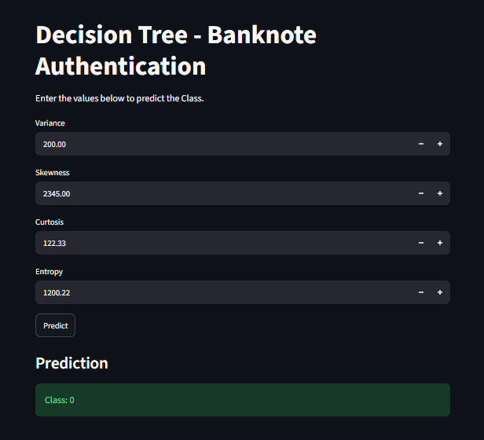

# 🌳 Banknote Authentication using Decision Tree

## 📌 Project Overview

This project uses a **Decision Tree Classification** algorithm to predict whether a banknote is authentic or not.

Two Decision Tree criteria were compared:

* **Gini**
* **Entropy**

After comparing the model performances, the **Entropy Decision Tree** achieved the best test accuracy of **98.5%**.

The final trained model was saved using Pickle and integrated into a **Streamlit application** for interactive banknote classification.

---

## 📸 Project Screenshot

Click the screenshot below to open the full-size image.

[](Screenshot/app.dt.png.png)

---

## 📊 Dataset

The project uses the **Banknote Authentication Dataset**.

### Features

| Feature    | Description                    |
| ---------- | ------------------------------ |
| `Variance` | Variance of the banknote image |
| `Skewness` | Skewness of the banknote image |
| `Curtosis` | Curtosis of the banknote image |
| `Entropy`  | Entropy of the banknote image  |
| `Class`    | Target variable                |

### Target

The `Class` column is used as the target variable for classification.

---

## 🤖 Machine Learning Algorithm

The main algorithm used is:

**Decision Tree Classifier**

Two splitting criteria were evaluated:

```python
criterion="gini"
```

and

```python
criterion="entropy"
```

Both models were trained using the same train-test split:

```python
train_test_split(
    X,
    y,
    test_size=0.20,
    random_state=42
)
```

Using the same `random_state=42` makes the comparison consistent and reproducible.

---

## 📈 Model Performance

| Model                   | Test Accuracy |
| ----------------------- | ------------: |
| Decision Tree - Gini    |         98.1% |
| Decision Tree - Entropy |     **98.5%** |

### 🏆 Selected Model

The **Entropy Decision Tree** was selected because it achieved the higher test accuracy.

```python
DecisionTreeClassifier(
    criterion="entropy",
    random_state=42
)
```

### Final Accuracy

**98.5%**

---

## 💾 Model Saving

The trained Entropy Decision Tree model was saved using Python's `pickle` library.

```python
import pickle

with open("decision_tree_entropy.pkl", "wb") as file:
    pickle.dump(dt_entropy, file)
```

The saved model is:

```text
decision_tree_entropy.pkl
```

---

## 🖥️ Streamlit Application

The trained model is integrated into a Streamlit application.

Users can enter the following banknote features:

* Variance
* Skewness
* Curtosis
* Entropy

The application then predicts the corresponding banknote class.

### Application Flow

```text
User Input
    ↓
Variance
Skewness
Curtosis
Entropy
    ↓
Entropy Decision Tree
    ↓
Prediction
    ↓
Class 0 / Class 1
```

---

## 📂 Project Structure

```text
banknote-authentication-decision-tree/
│
├── Screenshot/
│   └── Screenshot.png
│
├── app.py
├── banknotes .csv
├── decision_tree_entropy.pkl
├── requirements.txt
├── .gitignore
└── README.md
```

---

## 📄 Files Description

| File / Folder               | Description                         |
| --------------------------- | ----------------------------------- |
| `app.py`                    | Streamlit application               |
| `decision_tree_entropy.pkl` | Trained Entropy Decision Tree model |
| `banknotes .csv`            | Banknote Authentication dataset     |
| `requirements.txt`          | Required Python libraries           |
| `Screenshot/`               | Project screenshots                 |
| `.gitignore`                | Files excluded from GitHub          |
| `README.md`                 | Project documentation               |

---

## 🛠️ Technologies Used

* Python
* Pandas
* NumPy
* Scikit-learn
* Matplotlib
* Streamlit
* Pickle
* Google Colab
* VS Code
* Git
* GitHub

---

## ⚙️ Installation

### 1. Clone the Repository

```bash
git clone https://github.com/shivani14012004/banknote-authentication-decision-tree.git
```

### 2. Navigate to the Project

```bash
cd banknote-authentication-decision-tree
```

### 3. Install Dependencies

```bash
pip install -r requirements.txt
```

### 4. Run the Streamlit Application

```bash
streamlit run app.py
```

The application will open in your browser.

---

## 🎯 Project Objectives

* Load and explore the banknote dataset.
* Perform data preprocessing.
* Separate features and target.
* Split the dataset into training and testing sets.
* Build a Decision Tree using Gini.
* Build a Decision Tree using Entropy.
* Compare both models.
* Select the better-performing model.
* Save the trained model using Pickle.
* Create a Streamlit application.
* Make real-time banknote predictions.

---

## 🏆 Results

The model comparison produced the following results:

```text
Gini    → 98.1%
Entropy → 98.5%
```

Therefore, the **Entropy Decision Tree** was selected as the final model.

The final model achieved:

### ⭐ 98.5% Test Accuracy

---

## 🔮 Future Improvements

* Add confusion matrix visualization.
* Add precision, recall, and F1-score.
* Add classification report.
* Add feature-importance visualization.
* Improve the Streamlit user interface.
* Compare the model with Random Forest, KNN, SVM, and Logistic Regression.
* Add input validation.

---

## 👩‍💻 Author

**Shivani Patil**

GitHub: [@shivani14012004](https://github.com/shivani14012004)

---

## ⭐ Conclusion

This project demonstrates the use of a **Decision Tree Classifier** for banknote authentication.

Both Gini and Entropy criteria were evaluated using the same train-test split. The Entropy model achieved the better accuracy of **98.5%**.

The selected model was saved using Pickle and integrated into a Streamlit application for interactive banknote classification.

⭐ **If you find this project useful, consider giving the repository a star!**
